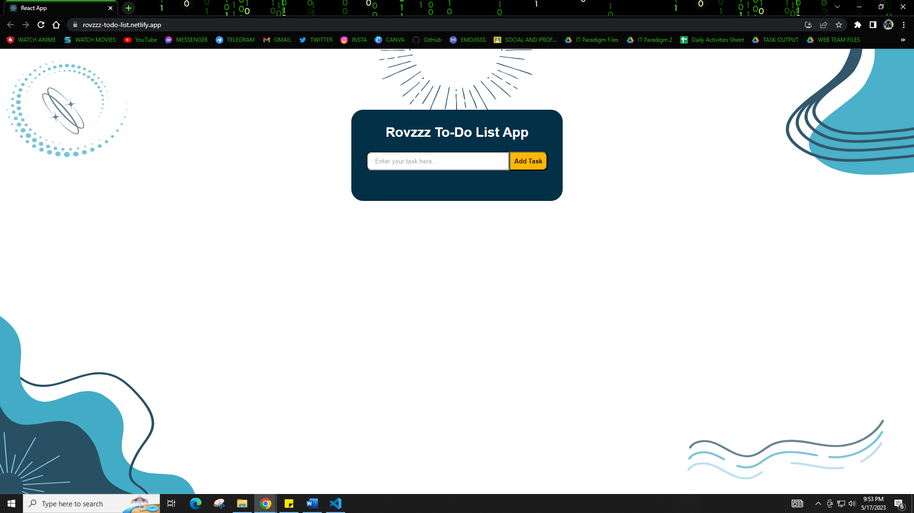

# React To-Do List App (Coding Challenge)

This project was or coding challenge was developed using ReactJS. This is a simple responsive To-Do List app where you can add new tasks, edit, delete, and complete the task. See the INSTRUCTIONS below to know how to use the To-Do List App in your PC.

> Website Link: [https://rovzzz-todo-list.netlify.app/](https://rovzzz-todo-list.netlify.app/)

Website Screenshot: 
 

# How to Use / Install the Project?

Step 1: Download the project by clicking the "<>Code" button in GitHub and choose "Download ZIP" or clone it.

Step 2: Download NodeJS from [https://nodejs.org/en/download](https://nodejs.org/en/download). After installing NodeJS, you can now go to the project directory/folder.

Step 3: Open cmd and redirect to the project directory using "cd <directory/path>".

Step 4: Now, type the following command:

### `npm i` 

 >This will install all the dependencies from the package.json file in the project directory.
>
Step 5: After installing the dependencies, you can now start the server by running the following command:

### `npm start`

>Runs the app in the development mode.\
It will automatically open [http://localhost:3000](http://localhost:3000) to view it in your browser.
> 
>The page will reload when you make changes.\
You may also see any lint errors in the console.

And there you go! We are good to go!

# OTHER COMMANDS YOU CAN USE:

### `npm test`

> Launches the test runner in the interactive watch mode.\
See the section about [running tests](https://facebook.github.io/create-react-app/docs/running-tests) for more information.

### `npm run build`

> Builds the app for production to the `build` folder.\
It correctly bundles React in production mode and optimizes the build for the best performance.
> 
> The build is minified and the filenames include the hashes.\
Your app is ready to be deployed!
> 
> See the section about [deployment](https://facebook.github.io/create-react-app/docs/deployment) for more information.

### `npm run eject`

> **Note: this is a one-way operation. Once you `eject`, you can't go back!**
> 
> If you aren't satisfied with the build tool and configuration choices, you can `eject` at any time. This command will remove the single build dependency from your project.
> 
> Instead, it will copy all the configuration files and the transitive dependencies (webpack, Babel, ESLint, etc) right into your project so you have full control over them. All of the commands except `eject` will still work, but they will point to the copied scripts so you can tweak them. At this point you're on your own.
> 
> You don't have to ever use `eject`. The curated feature set is suitable for small and middle deployments, and you shouldn't feel obligated to use this feature. However we understand that this tool wouldn't be useful if you couldn't customize it when you are ready for it.

